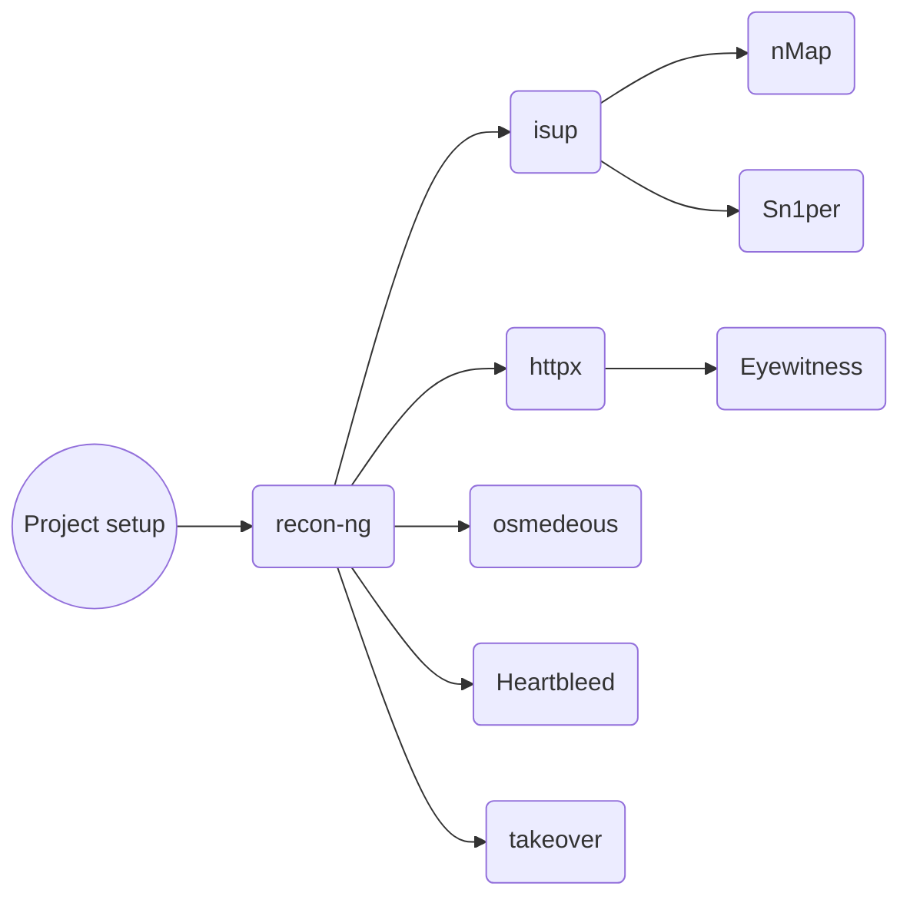

# introduction:
What you see here is an overview of how i approach reacon.

## Roadmap:


## Project setup
Create Folders (subdomains, urls, ips,patterns,params,javascript). here is a good oneliner:
```bash
export projectname=[name]
```
``` bash
mkdir ~/$projectname && cd ~/$projectname && mkdir subdomains urls ips patterns params javascripts
```

## Recon
### Recon-ng
install recon-ng. use it to search Passively for subdomains ips ports
here are some of the commands you may need
```bash
workspaces create

#insert domains
db insert domain

#insert company name
db insert company

# if you have a narrow scope you can enter the hosts using this command
db insert host

# now load some modules and then run
modules load recon/domai.....
run

# save the list 
modules load reporting/list
# save ip addresses
options set FILENAME ~/$projectname/ips/ips.txt
run
# save domains
options set COLUMN host
options set FILENAME ~/$projectname/subdomains/subdomains.txt
run
```

now make sure you are in your working directory:
```bash
cd ~/$projectname
```

#### Check if ips are alive:
check if ips are alive using isup.
```bash
cd ~/isup && rm tmp -R &&./isup.sh ~/$projectname/ips/ips.txt && cp ~/isup/tmp/valid-ips.txt ~/$projectname/ips/valid-ips.txt
```

#### Validate subdomains:
validate domains using httpx:
```bash
cat ~/$projectname/subdomains/subdomains.txt | httpx -verbose > ~/$projectname/urls/urls.txt
```

#### Use Nmap Aggressive Scan:
```bash
nmap -iL ~/$projectname/ips/valid-ips.txt -sSV -A -T4 -O -Pn -v -F -oX $projectname_nmap_result.xml
```
#### Sn1per - WebApp Mode: 
```bash
sniper -f ~/$projectname/ips/ips.txt -m massweb -w $projectname
```
then save the result and copy them to our working folder!
```bash
# complete this
```

#### Eyewitness to take Screenshots of all URLS
```bash
cd ~/$projectname/ && eyewitness -f ~/$projectname/urls/urls.txt
```
```bash
zip -r $projectname.zip foldername
```

#### Nuclei
for scanning everything:
```bash
nuclei -l ~/$projectname/urls/urls.txt -o ~/$projectname/nucleai_cve_result.txt
```
for cve only:
```bash
nuclei -l ~/$projectname/urls/urls.txt -t /root/nuclei-templates/cves/ -o ~/$projectname/nucleai-cve-result.txt
```

#### Jaeles:
```bash
cat ~/$projectname/urls/urls.txt | jaeles scan -s 'cves' -s 'sensitive' -s 'fuzz' -s ‘common' -s 'routines' report -o ~/$projectname/Jaeles-cve-result.txt --title "[$projectname] Jaeles Full Report"
```

#### chopchop 

```bash
~/ChopChop/gochopchop scan --url-file ~/$projectname/urls/urls.txt --threads 4 -e csv --export-filename ~/$projectname/chopchop-result.txt
```

#### inception
```bash
# write this
```

#### use osmedeous to search for vulenerablities: 
Select one of these actions
directly run on vuln scan and directory scan on list of domains :
```bash
osmedeus scan -f vuln-and-dirb -t ~/$projectname/subdomains/subdomains.txt
```
scan list of targets :
```bash
osmedeus scan -T ~/$projectname/subdomains/subdomains.txt
```
get target from a stdin and start the scan with 2 concurrency :
```bash
cat ~/$projectname/subdomains/subdomains.txt | osmedeus scan -c 2
```
start a simple scan with default 'general' flow :
```bash
osmedeus scan -t sample.com
```
then save the result and copy them to our working folder!
```bash
# complete this
```

#### Check for Heartbleed:

```bash
cat ~/$projectname/subdomains/subdomains.txt | while read line ; do echo "QUIT" | openssl s_client -connect $line:443 2>&1 | grep 'server extension "heartbeat" (id=15)' || echo $line: safe; done
```

Extract Javascripts from domains, and fetch only the URLS from those big files, can also be used with any type of file containing huge data:

First use getJs to get the Javascripts:

```
getJS --url website.com --output /root/results.txt
```

```
getJS --input urls.txt --output /root/results.txt
```

Extract URLs directly or from a file using this one-liner:

From any type of file:
```
cat file | grep -Eo "(http|https)://[a-zA-Z0-9./?=_-]*"*
```

Directly from a website:
```
curl https://domain.xx/file.js | grep -Eo "(http|https)://[a-zA-Z0-9./?=_-]*"*
```

OSINT: (Can be done on RPI)

Check for Domain TakeOver with Takeover by M4llok 

Takeover Tool: 
```
takeover -l sub_domains.txt -v -t 10
```

**Check for open Amazon S3 buckets
```
ls | grep s3 from nuclei-templates/technologies
```

Can use nuclei -l urls.txt -t /root/nuclei-templates/technologies/s3-detect.yaml

Attack Buckets: New!

https://github.com/blackhatethicalhacking/s3-buckets-aio-pwn

6. Use ParamSpider to Hunt for URLS with Parameters automatically from wayback machine - You can also use Arjun, we are switching to ParamSpider as part of building a workflow 

```
python3 paramspider.py --domain DOMAINNAME.com --exclude woff,png,svg,php,jpg --output /root/Desktop/Bounty/params.txt
```

Technique to Clean Params from XSS:

```
sed 's/unix/linux/g' reconfile.txt
```
 
7. Use Smuggler on URLs list to test for http requests that could desync, and posting multiple chunked requests to smuggle external sources so the backend server will forward the request with cookies, data to the front end server
   
(Can be done on RPI)

```
cat list_of_urls.txt | python3 smuggler.py -l /root/location.txt
```

**Bonus**


Examine the Results Manually


B) Pattern Check Example for Results with gf & gf-patterns: 

After you have the Parameters Gathered, we want to check for specific patterns and possible vulnerable URLs that can be attacked using Meg or other Fuzzing Tools.
```
cat /root/Desktop/Bounty/params.txt | gf xss | sed 's/FUZZ/ /g' >> /root/Desktop/Bounty/xss_params_forMeg.txt
```

Very Powerful One Liner - You can Pipe also directly to Meg.


8. Use Meg with Seclist fuzzing for Links: (Gathered from gau/arjun/paramspider/gf)

For Meg, we must remove the ‘FUZZ’ from paramspider and replace it with a null character:

```
sed 's/FUZZ//g' reconfile.txt
```
```
meg -v LFI-gracefulsecurity-linux.txt /root/Desktop/Bounty/urls.txt /root/Desktop/urls.txt -s 200
```

9. JSScanner: 

Scanning Javascript Files for Endpoints, Secrets, Hardcoded credentials,IDOR, Openredirect and more

Paste URLS into `alive.txt`

Run script `alive.txt` - Examine the results using GF advanced patterns

Use tree command, cat into subdirectories:
```
cat * */*.txt
cat */*.js | gf api-keys	
cat /*/*.txt | gf ssrf > /root/Desktop/ssrf.txt
```

Or New Method with GitLeaks: New!

Scan a Directory with Javascripts, Files, Json Etc.. for Secrets!
```
gitleaks --path=/directory -v --no-git
```

Scan a File with Any Extension for Secrets!
```
gitleaks --path=/file.xxx -v --no-git
```
 
10. Find XSS Vulnerabilities from Paramspider & Dalfox New!

Since we have params urls from paramspider, dalfox needs to know where to inject, and you can define it with XSS instead of FUZZ, so here is a command to replace this from the result, and create a new list to be used on dalfox.

```
sed 's/FUZZ/XSS/g' reconfile.txt
```

You are now ready for parsing the urls into dalfox in pipe mode:


```
cat /root/Desktop/Bounty/xss_params.txt | dalfox pipe | cut -d " " -f 2 > output.txt
```

or

```
dalfox file /root/Desktop/Bounty/xss_params.txt | cut -d " " -f 2 > output.txt
```

For Deeper Attacks add this:

--deep-domxss

Silence --silence Prints only PoC When found and progress

10 - After Recon: New!

When you find Keys/Tokens - Check from here: https://github.com/streaak/keyhacks

********************************************************************************************************************

OSINT & Passive Amplified Attacks: (Raspberry Pi)

OSINT:

Perform OSINT using spiderfoot

One off 1337 Powerful Command Attacks with amass:


#### use Gotty - https://github.com/yudai/gotty

```
gotty -p 1337 -w recon-ng 
```

Gau - for realtime URL extraction when performing manual search so you can have urls to attack.

Hunt for Links that have Parameters by using gau (Get all URLS) and displaying all links that have params: 

```
cat subdomains.txt | gau | tee /root/Desktop/urls.txt | lolcat
```

```
gau domains -o urls.txt
```

```
gau example.com
```

```
gau -o example-urls.txt example.com
```

```
gau -b png,jpg,gif example.com
```

# Tools

Here are some of the tools that we use when we perform Live Recon Passive ONLY on Twitch:

1) Recon-ng
https://github.com/lanmaster53/recon-ng
2) httpx
https://github.com/projectdiscovery/httpx
3) isup.sh
https://github.com/gitnepal/isup
4) Arjun
https://github.com/s0md3v/Arjun
5) jSQL
https://github.com/ron190/jsql-injection
6) Smuggler
https://github.com/defparam/smuggler
7) Sn1per
https://github.com/1N3/Sn1per
8) Spiderfoot 
https://github.com/smicallef/spiderfoot
9) Nuclei
https://github.com/projectdiscovery/nuclei
10) Jaeles
https://github.com/jaeles-project/jaeles
11) ChopChop
https://github.com/michelin/ChopChop
12) Inception
https://github.com/proabiral/inception
13) Eyewitness
https://github.com/FortyNorthSecurity/EyeWitness
14) Meg
https://github.com/tomnomnom/meg
15) Gau - Get All Urls
https://github.com/lc/gau
16) Snallygaster
https://github.com/hannob/snallygaster
17) NMAP
https://github.com/nmap/nmap
18) Waybackurls
https://github.com/tomnomnom/waybackurls
19) Gotty
https://github.com/yudai/gotty
20) GF
https://github.com/tomnomnom/gf
21) GF Patterns
https://github.com/1ndianl33t/Gf-Patterns
22) Paramspider
https://github.com/devanshbatham/ParamSpider
23) XSSER
https://github.com/epsylon/xsser
24) UPDOG
https://github.com/sc0tfree/updog
25) JSScanner
https://github.com/dark-warlord14/JSScanner
26) Takeover
https://github.com/m4ll0k/takeover
27) Keyhacks
https://github.com/streaak/keyhacks
28) S3 Bucket AIO Pwn
https://github.com/blackhatethicalhacking/s3-buckets-aio-pwn
29) BHEH Sub Pwner Recon
https://github.com/blackhatethicalhacking/bheh-sub-pwner
30) GitLeaks
https://github.com/zricethezav/gitleaks
31) Domain-2IP-Converter
https://github.com/blackhatethicalhacking/Domain2IP-Converter
32) Dalfox
https://github.com/hahwul/dalfox
33) Log4j Scanner
https://github.com/Black-Hat-Ethical-Hacking/log4j-scan
34) Osmedeus
https://github.com/j3ssie/osmedeus
35) getJS
https://github.com/003random/getJS

